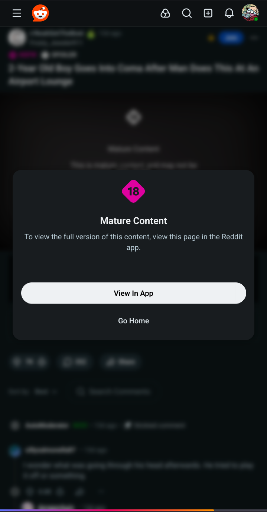
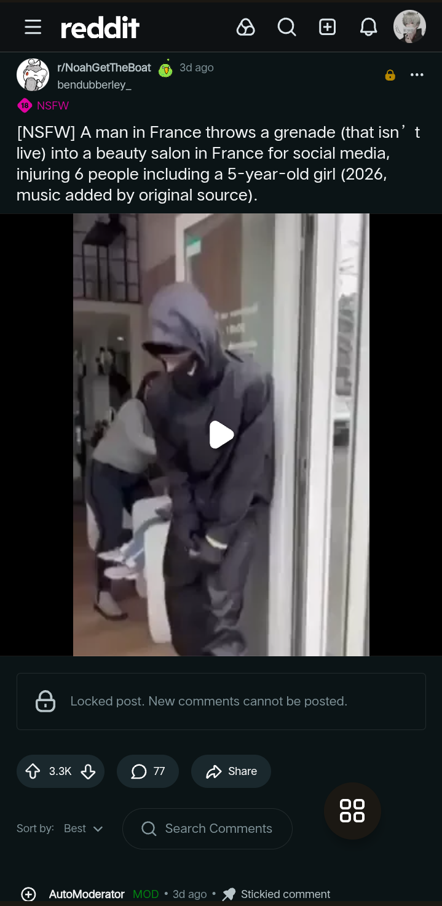

---

# Sociality Beta-1.0
> *A minimalist webwrapper for modern Social Media websites*

---

## Why Sociality?

**Sociality** is my active rebellion against bloated social media giants and their resource-heavy background processes. 

I built this project to drastically reduce the number of social media apps installed on my phone, effectively stripping away bloat and background processes to reclaim my battery life. 

The problem is that using social media via a mobile browser is usually a clunky, annoying experience. The UI feels "off," and you are constantly bombarded with "OPEN APP" or "Download our App" prompts that make a seamless experience nearly impossible. **Sociality fixes this.** I’ve designed the UI to be **minimalist**, **modern**, and **ergonomic**, using custom CSS injections to surgically improve site UX for a **seamless** and **smooth** experience.

> **Ditch the bloat. Reclaim your battery. Keep your social life.**

---

### Key Features

* **Smart UI Injection**
    * **Custom CSS Overrides:** Aggressive styling to hide "Open in App" banners, intrusive headers, and layout bloat.
    * **UI De-Cluttering:** Custom scripts that strip away pesky blockages that hinder the mobile web experience.
* **Deep Link Integration**
    * **Native Link Handling:** Intercepts supported social media URLs to open them directly within Sociality.
* **Performance & Utility**
    * **Intelligent Caching:** Optimized web resource storage to ensure faster load times.
    * **Full Media Support:** Robust handling for both **uploading** and **downloading** content.
    * **User-Agent Switching:** Toggle instantly between **Mobile** and **Desktop** modes to bypass site restrictions.
* **Slick Navigation**
    * **Expanding Floating Site Picker:** A minimalist menu to jump between platforms instantly.
    * **Dedicated Controls:** Essential tools only, including a quick-access **Reload** button.

---

### Visual Changes
<small> *Sociality surgically removes "Download App" bloat to reclaim your screen space along with other UI fixes.* </small>

| Feature | Standard Webview (Before) | Sociality (After Injection) |
| :--- | :--- | :--- |
| **Reddit** |  |  |

> ***Unable to show other exampled due to Privacy and Doxxing Concerns***

---

 ### Supported Platforms
<small> Only the listed sites are supported now... </small>

* **Reddit**
* **Facebook**
* **X (Twitter)**
* **Instagram**
* **Threads**
* **LinkedIn**
* **GitHub**
* **Bluesky**
* **Xikipedia** — *(Check out the original project: [Xikipedia](https://github.com/rebane2001/xikipedia))*
  
---

### Deep Link Setup (CRITICAL)
<small> The app will prompt you to do this everytime you open it if you do not do this.</small>

To ensure **Sociality** handles social media links instead of your default browser, you must manually enable link handling in the Android system settings.

> ### Manual Action Required
> Because these domains are unverified (Deep Links rather than App Links), Android will not toggle them automatically. **If you skip this, links will continue to open in your browser.**

### To enable redirection:
1. Open **Settings** on your Android device.
2. Navigate to **Apps** > **Sociality**.
3. Tap on **Set as default** (or **Open by default**).
4. Locate the **Open supported links** toggle and turn it ***ON***.
5. (Optional) Under **Supported web addresses**, ensure all relevant social media domains are checked.

---

 ### Future Roadmap

> *List of changes yet to come*
 
* **Remove Instagram/ figure out a beter implementation.**
* **Full restructuring of the app for even better performance, I.E Using state-mangement/multiple webviews.**
* **Add support for other social media.**
  
---

## License

This project is licensed under the **MIT License**. 

I believe in open-source and the right to a bloat-free web. You are free to use, modify, and distribute this software, provided that the original license and copyright notice are included. 

See the [LICENSE](LICENSE.md) file for the full legal text.

---
